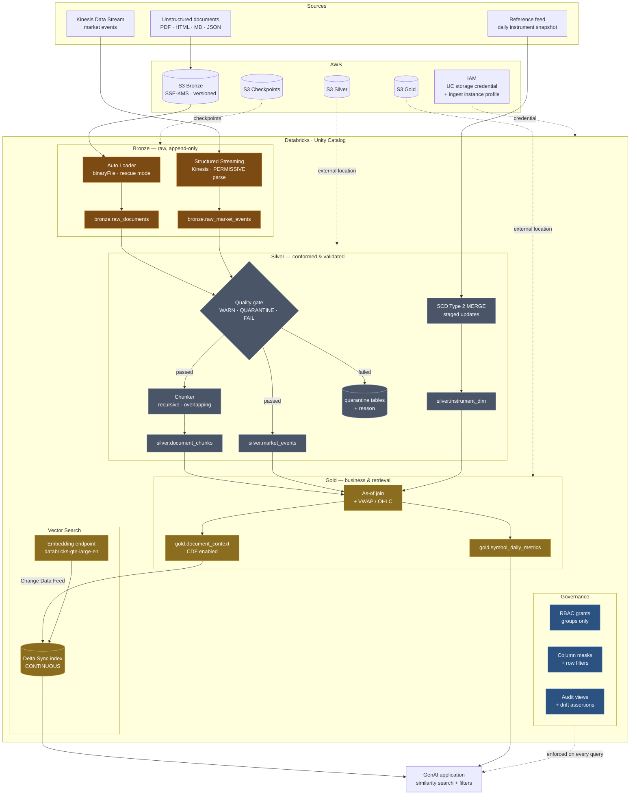

# Real-Time GenAI Lakehouse & Vector Search Platform

A production scaffold for a streaming medallion lakehouse on **AWS + Databricks**,
with governed retrieval-augmented generation on top of it.

Unstructured documents and real-time market events land in Bronze, are conformed
and validated in Silver (including a Type 2 history for reference data), and are
aggregated in Gold into both business metrics and a chunked corpus that
Databricks Vector Search keeps continuously indexed. Unity Catalog governs the
whole path: one physical copy of each table, with column masking evaluated per
caller at query time.

---

## Architecture



### Data flow at a glance

| Layer | Written by | Contract |
|---|---|---|
| **Bronze** | Auto Loader, Kinesis stream | Append-only, verbatim. Raw payload always preserved. No validation beyond "the bytes were readable". |
| **Silver** | `foreachBatch` MERGE | Typed, deduplicated on the natural key, quality-gated. Rejected rows are quarantined with a reason, never dropped. |
| **Gold** | Hourly batch | Business aggregates with point-in-time dimension attribution; the chunk table the vector index syncs from. |

---

## Repository layout

```
genai-lakehouse-platform/
├── terraform/                     # AWS + Unity Catalog infrastructure
│   ├── main.tf                    # wires the four modules together
│   ├── modules/
│   │   ├── s3_lakehouse/          # Bronze/Silver/Gold/checkpoint buckets, KMS, lifecycle
│   │   ├── iam/                   # UC storage credential + streaming ingest roles
│   │   ├── kinesis/               # stream, KMS, iterator-age alarms
│   │   └── unity_catalog/         # metastore, credential, external locations, catalog
│   └── envs/{dev,prod}/           # tfvars + backend config per environment
├── pipelines/
│   ├── common/                    # config, schemas, quality, SCD2, chunking, transforms
│   ├── bronze/                    # autoloader_documents.py, kinesis_market_events.py
│   ├── silver/                    # documents_silver.py, market_events_silver.py, instrument_scd2.py
│   ├── gold/                      # gold_aggregates.py, vector_index.py
│   └── resources/jobs.yml         # Databricks Asset Bundle job definitions
├── governance/                    # Unity Catalog SQL + the runner that applies and asserts it
├── tests/                         # 167 tests, no cloud account required
├── scripts/                       # post-deploy smoke test
├── .github/workflows/             # ci.yml (validation), cd.yml (deployment)
└── databricks.yml                 # Asset Bundle targets
```

---

## Setup

### Prerequisites

| Tool | Version | Notes |
|---|---|---|
| Terraform | ≥ 1.10 | `use_lockfile` (native S3 state locking) requires 1.10+ |
| Python | 3.10 – 3.11 | 3.11 matches Databricks Runtime 15.4 LTS |
| Java | 17 | only for running the test suite locally |
| Databricks CLI | ≥ 0.220 | Asset Bundles |
| AWS account | — | with permission to create S3, KMS, IAM, Kinesis |
| Databricks account | Premium or above | Unity Catalog + Vector Search require it |

### 1. Bootstrap the Terraform backend (once per account)

The state bucket is deliberately **not** managed by this configuration — a
bootstrap that manages its own backend cannot be cleanly destroyed or recovered.

```bash
aws s3api create-bucket \
  --bucket genai-lakehouse-tfstate-$(aws sts get-caller-identity --query Account --output text) \
  --region us-east-1
aws s3api put-bucket-versioning \
  --bucket genai-lakehouse-tfstate-... --versioning-configuration Status=Enabled
```

Then point `terraform/envs/<env>/backend.hcl` at it.

### 2. Create a Databricks service principal

Terraform authenticates as an OAuth (M2M) service principal that holds the
**account admin** role — metastore creation is an account-level operation.

```bash
export TF_VAR_databricks_client_id=<application-id>
export TF_VAR_databricks_client_secret=<oauth-secret>
```

Fill in the real account id, workspace host and workspace id in
`terraform/envs/<env>/terraform.tfvars`.

### 3. Apply the infrastructure

```bash
cd terraform
terraform init -backend-config=envs/dev/backend.hcl
terraform plan  -var-file=envs/dev/terraform.tfvars
terraform apply -var-file=envs/dev/terraform.tfvars
```

> **One metastore per region.** `create_metastore = true` in exactly one
> environment; every other environment passes that metastore's id via
> `metastore_id`. `envs/dev` owns it in this scaffold.

Export the runtime configuration the pipelines read:

```bash
terraform output -json pipeline_config > ../conf/dev.json
```

### 4. Apply governance

```bash
python governance/apply.py --catalog genai_lakehouse_dev --environment dev --dry-run  # review
python governance/apply.py --catalog genai_lakehouse_dev --environment dev --assert   # apply
```

`PII_HASH_SALT` must be set and **stable per environment** — it salts the
pseudonymised name hashes, so rotating it silently breaks every join that
depends on them.

### 5. Deploy the jobs

```bash
python -m build --wheel
databricks bundle validate -t dev
databricks bundle deploy   -t dev
databricks bundle run streaming_ingest -t dev
```

### 6. Build the vector index

```bash
python -m pipelines.gold.vector_index --conf conf/dev.json --wait
python scripts/retrieval_smoke_test.py --conf conf/dev.json
```

Endpoint creation takes several minutes; `--wait` polls until it is `ONLINE`.

---

## Running the tests

```bash
pip install -r requirements-dev.txt
pytest tests/ -q
```

167 tests, ~45 seconds, no cloud account touched. They cover chunking
determinism, quality-gate semantics, SCD2 staging (the case that produces two
writes from one row), point-in-time joins, volume-weighted aggregation, and the
governance SQL's policy invariants.

Coverage:

```bash
pytest tests/ --cov=pipelines --cov=governance --cov-report=term-missing
```

---

## Design decisions worth knowing

**Bronze keeps the raw payload even after parsing it.** When a producer changes
its contract at 03:00, the parsed columns go NULL but `_raw_payload` still holds
the truth, and the stream can be replayed from Bronze once the parser is fixed.

**Bad rows are quarantined, not dropped.** Every quality failure lands in a
`*_quarantine` table with the violated rule names attached. A `FAIL` action is
reserved for violations that mean the upstream contract itself is broken.

**A NULL condition counts as a failure.** "I could not evaluate this rule" is
not evidence that the row is fine — the single most common silent hole in a
data quality gate.

**SCD2 uses staged updates.** One changed source row needs two target writes
(close the old version, open the new one), which a MERGE cannot express
directly. The source is expanded first, with a NULL merge key forcing the
INSERT branch. An unchanged row produces *no write at all*, so re-running the
job is genuinely idempotent.

**Silver writes with MERGE, not append.** A micro-batch replayed after a driver
restart must update, not duplicate. `chunk_id` is a hash of
`document_id + chunk_index`, and `document_id` is a hash of the file content —
so a re-uploaded document is the same document all the way to the index.

**Masking is dynamic, not a second copy.** `is_account_group_member()` is
evaluated against the *query's* principal, so one physical table serves the
steward, the analyst and the service principal differently. There is no
unmasked copy to leak.

**The catalog is `ISOLATED`.** It is only visible in workspaces explicitly bound
to it — the control that stops a dev workspace from reading prod Gold.

**Vector Search uses a Delta Sync index with `embedding_source_column`.**
Databricks reads the Gold table's Change Data Feed and calls the embedding model
itself, so there is no embedding job to run and no drift between what is in
Delta and what is in the index. Losing CDF on that table is silent — the index
keeps serving stale answers — which is why CI asserts it on every deploy.

---

## CI/CD

| Workflow | Trigger | Does |
|---|---|---|
| `ci.yml` | every push / PR | ruff, PyTest on 3.10 + 3.11, `terraform fmt`/`validate` (root + every module), Checkov, governance SQL dry run, bundle validate, wheel build |
| `cd.yml` | PR → plan · main → dev · manual → prod | Terraform plan (commented on the PR), apply the **saved** plan, deploy the bundle, apply governance with `--assert`, retrieval smoke test |

Deployment authenticates to AWS by **OIDC role assumption** — no long-lived
access keys in secrets. Production is gated behind a GitHub Environment
approval.

### Required secrets

| Secret | Used by |
|---|---|
| `AWS_TERRAFORM_ROLE_ARN` | OIDC role assumed by plan/apply |
| `DATABRICKS_CLIENT_ID` / `DATABRICKS_CLIENT_SECRET` | Terraform + bundle deploy |
| `DATABRICKS_HOST` / `DATABRICKS_TOKEN` / `DATABRICKS_WAREHOUSE_ID` | governance SQL |
| `PII_HASH_SALT` | name pseudonymisation (stable per environment) |

> **Workflow location.** GitHub Actions only reads workflows from
> `.github/workflows` at the **repository root**. Because this platform lives in
> a subdirectory here, `ci.yml` is mirrored to
> `.github/workflows/genai-lakehouse-ci.yml` at the root and every job sets
> `working-directory`. In a standalone repository, drop the
> `defaults.run.working-directory` blocks and the `paths:` filters.

---

## Operating notes

**Auto Loader file discovery.** Directory listing is O(files in directory) per
micro-batch and degrades past ~100k files. Set `use_file_notifications` in the
config to switch to SQS/SNS notification mode before the drop zone grows — the
IAM policy for it is already provisioned.

**Kinesis iterator age is the health metric.** It is how far behind real time
the consumer is; the CloudWatch alarm in `modules/kinesis` fires at 10 minutes.
Record counts tell you nothing by comparison.

**`initialPosition` defaults to `TRIM_HORIZON`.** `LATEST` silently drops
whatever was in flight when the job started — data loss should require a
deliberate config change.

**Streaming jobs restart weekly.** The `RUN_DURATION_SECONDS` health rule caps a
run at 7 days so library updates are actually picked up.

**`VACUUM` never goes below 168 hours.** Shorter retention breaks concurrent
readers and destroys the time travel an incident investigation needs. CI
asserts this.

---

## License

Apache-2.0.
